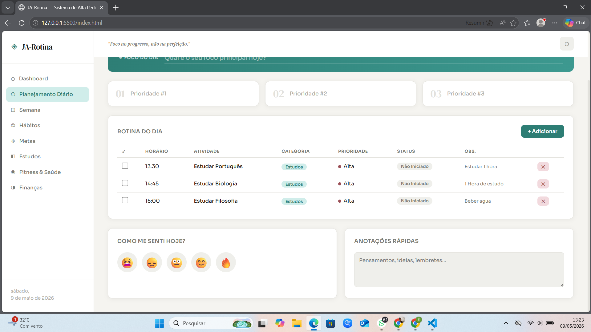

# ◈ JA-Rotina — Sistema Pessoal de Alta Performance

> Um planner digital completo, construído com HTML, CSS e JavaScript puro — sem frameworks, sem dependências, sem complicação.


---

##  O que é o JA-Rotina?

O **JA-Rotina** é um sistema pessoal de organização e produtividade que reúne, em uma única interface web, tudo que você precisa para gerenciar sua rotina com clareza e consistência.

Construído do zero com tecnologias web puras, roda **direto no navegador** — sem cadastro, sem servidor, sem internet. Os dados são salvos localmente via `localStorage`.

---

##  Estrutura do Projeto

```
JA-Rotina/
├── index.html   # Estrutura e marcação das 8 seções
├── style.css    # Design system completo com variáveis CSS
└── app.js       # Toda a lógica, estado e interatividade
```

---

##  Funcionalidades

### Dashboard
- KPIs semanais: sono médio, treinos, água, hábitos concluídos
- Barras de produtividade por dia da semana
- Progresso visual das metas principais
- Grid de consistência mensal (estilo GitHub contributions)
- Frase motivacional diária automática

### Planejamento Diário
- Campo de foco do dia
- Top 3 prioridades
- Tabela de tarefas com horário, categoria, prioridade e status
- Seletor de humor diário
- Anotações rápidas

###  Planejamento Semanal
- Cards de Segunda a Domingo
- Objetivos pessoais e profissionais da semana
- Bloco de revisão reflexiva semanal

###  Controle de Hábitos
- Tracker dos últimos 7 dias
- 9 hábitos pré-configurados
- Percentual de consistência por hábito
- Integração visual com o grid do dashboard

###  Metas & Objetivos
- Separadas por prazo: curto, médio e longo
- Barra de progresso + anel circular percentual
- Campos: título, prazo, motivo, passos, dificuldade, prioridade

###  Controle de Estudos
- Log de sessões com matéria, assunto, tempo e dificuldade
- **Timer Pomodoro** completo (25 min foco / 5 min pausa)
- Contador de sessões por dia

###  Fitness & Saúde
- Registro diário: água, sono, peso e nível de energia
- Log de exercícios com séries, repetições e peso
- Histórico dos últimos 7 dias

###  Controle Financeiro
- Lançamentos de entradas e saídas
- Saldo calculado automaticamente
- Gráfico de distribuição de gastos por categoria


---
##  Demonstração 


---

##  Como usar

### Opção 1 — Direto no navegador
```bash
git clone https://github.com/JAMAL-RED/JA-Rotina.git
cd JA-Rotina
# Abra index.html no navegador
```

### Opção 2 — VS Code + Live Server
1. Abra a pasta no VS Code
2. Instale a extensão **Live Server**
3. Clique com botão direito em `index.html` → **Open with Live Server**

---

---

##  Design System

| Token | Valor | Uso |
|---|---|---|
| `--teal` | `#2D7D74` | Cor primária / destaque |
| `--sage` | `#5C7A5C` | Positivo / concluído |
| `--amber` | `#B07D33` | Atenção / em andamento |
| `--rose` | `#9B5057` | Alerta / atrasado |
| `--bg` | `#F5F4F0` | Fundo geral |

**Tipografia:** Sora (interface) + DM Serif Display (títulos)

---

##  Persistência de Dados

Todos os dados são salvos automaticamente no `localStorage` do navegador. Nenhuma informação é enviada para servidores externos.

---

##  Responsividade
| Breakpoint | Comportamento |
|---|---|
| > 900px | Sidebar fixa, layout em grid completo |
| 600–900px | Sidebar recolhível via menu hambúrguer |
| < 600px | Layout em coluna única |

---

##  Exportar / Imprimir

Clique no ícone **⬡** no topo direito para gerar uma versão para impressão ou salvar como PDF (`Ctrl+P` / `Cmd+P`).

---

## Tecnologias

- **HTML5** semântico
- **CSS3** — variáveis customizadas, Grid e Flexbox
- **JavaScript ES6+** — vanilla, sem dependências externas
- **Google Fonts** — Sora & DM Serif Display
- **localStorage** — persistência local de dados

---


MIT License — sinta-se livre para usar, modificar e distribuir.

---

<p align="center"> foco e consistência · JA-Rotina</p>
